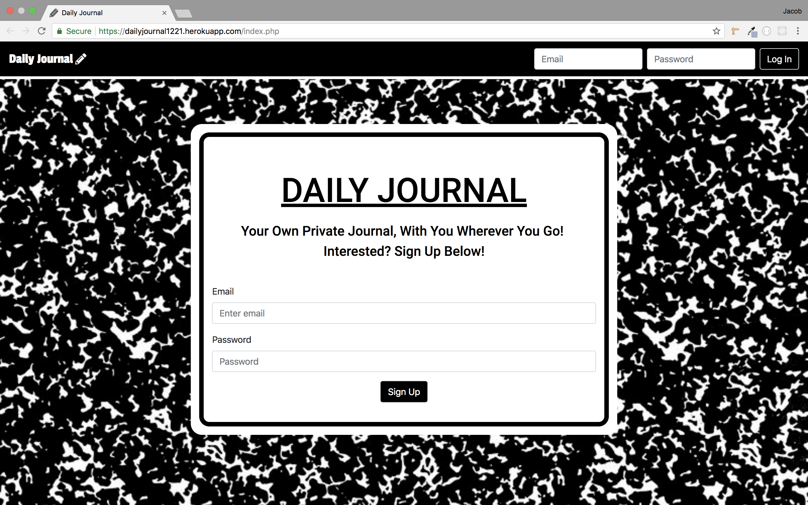
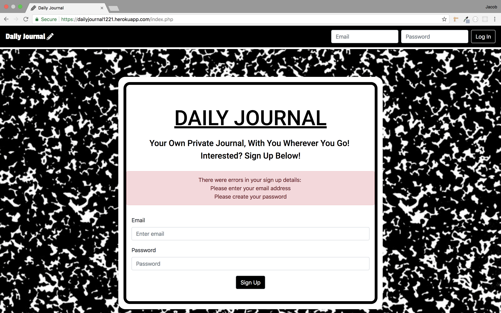
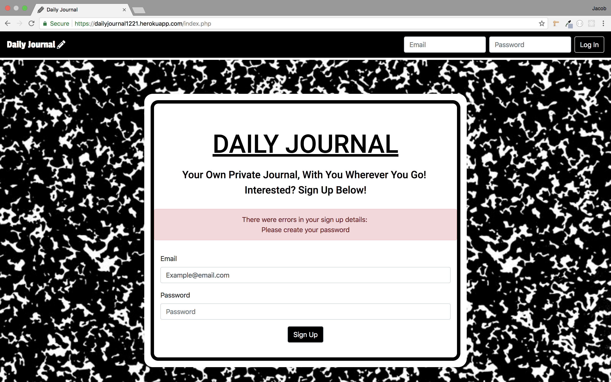
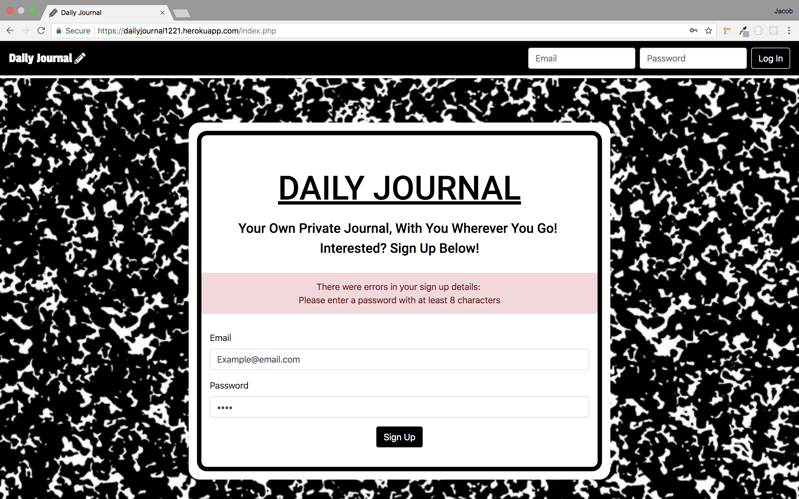
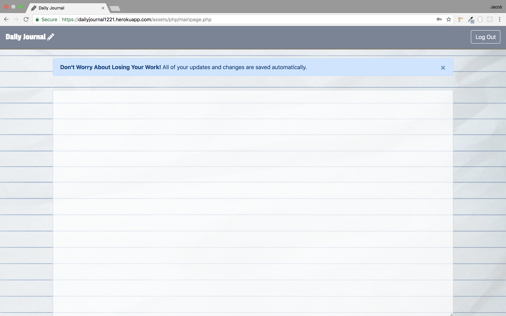
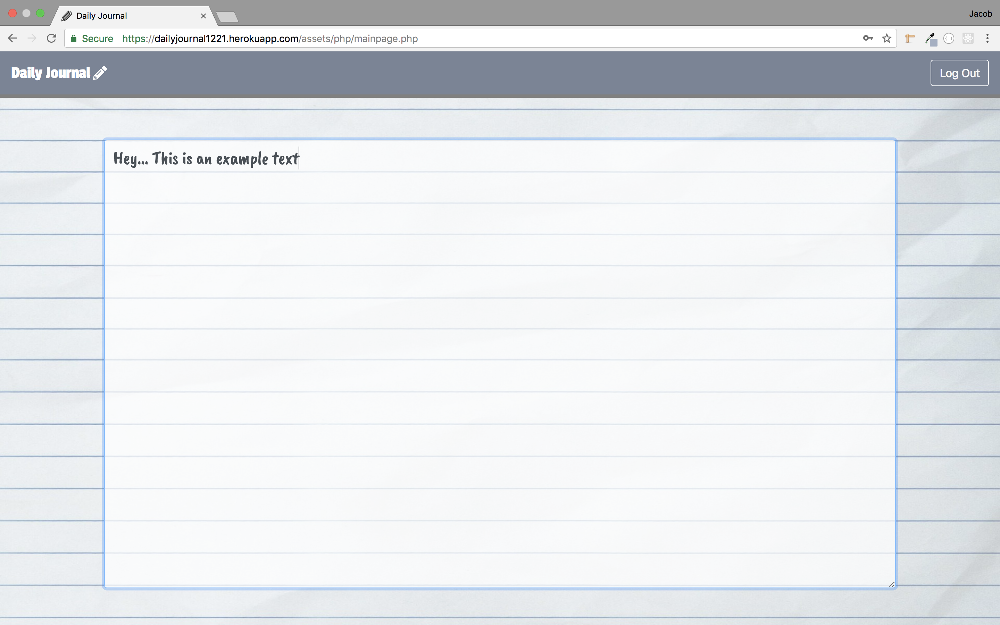
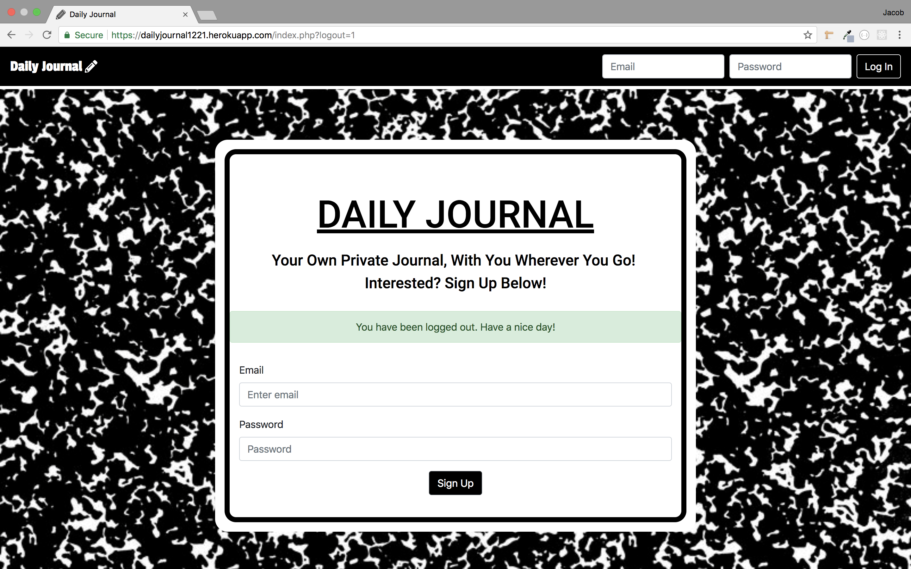

# Daily-Journal
Daily Journal is a cool web app I built for users to have a place to enter their daily notes, thoughts, and plans anywhere they want. It works well on Desktops, Tablets, and Mobile. I built it with HTML, CSS, JS, PHP, MySQL, AJAX, Bootstrap, and jQuery.

---

- This is the first screen the user sees upon loading the application. There is a place for the user to sign in on the top bar of the webpage. In the center of the page there is a form for the user to create a new account.

 - Below are a few examples of errors the user will see if not signing up for a new account properly. The first is not entering a email address or password.

- This is an error for not entering a password.

- Here is an error for not including at least one caplitel letter in the password.

- This is an error for having a capital letter but not having the password be at least 8 characters long.

